# 🧠 I Am... (in Bits and Bytes) – O Meu Eu Digital

### Projeto Final – Engenharia Web 2025  
**Grupo:** 24 - Pixel Pulse

**Autores:** João Manuel Machado da Cunha (A104611) / João Pedro Ribeiro de Sá (A104612) / Gonçalo da Silva Alves (A104079)

**Data de Entrega:** 1 de Junho de 2025  

**Docente:** José Carlos Ramalho

**Nota:** ? / 20 ⭐

---

## 📝 Resumo
O projeto final da UC Engenharia Web consiste no desenvolvimento de uma aplicação Web. Esta aplicação representa o "eu digital" de um utilizador (tem o nome de Francisco Castro, escolhido pelo grupo), funcionando como um diário pessoal. A plataforma permite o registo, armazenamento, gestão e visualização de eventos/conteúdos tais como fotos, registos de texto, conquistas, atividades desportivas, de uma forma geral, o que o utilizador decidir colocar no seu diário.

A solução abrange:
- *Frontend* desenvolvida com PUG e estilizada com W3.CSS e CSS nativo, permitindo a navegação fluida pelos conteúdos públicos.
- *API REST* que faz a conexão a uma base de dados MongoDB

---

## 🎯 Objetivos

- Criar um repositório digital pessoal baseado no modelo **OAIS**.
- Permitir ingestão de pacotes SIP contendo conteúdos diversos.
- Implementar autenticação tradicional e via redes sociais.


---

## ⚙️ Funcionalidades
### Utilizadores e Níveis de Acesso

- Três níveis de acesso à aplicação: Administrador, Utilizador Autenticado e Convidado;
- Apenas o Administrador pode fazer publicações;
- Apenas o Utilizador Autenticado pode efetuar comentários aos *posts*, evitando possíveis situações de má fé;

Estrutura de um modelo de um utilizador:
```txt
User : {
  email: String,
  username: String,
  password: String,
  name: String,
  birthdate: Date,
  role: {
    type: String,
    enum: ['user', 'admin'],
    default: 'user'
  },
  facebookId: String,
  googleId: String
}
```

Como é possível observar no esquema, um utilizador tem um email, um *username**, uma *password*, um nome, uma data de nascimento, uma *role* e possivelmente um *facebookId / googleId (caso o login seja feito manualmente, irão ser *null*)

\* inicialmente iamos utilizar o *username*, mas optámos por utilizar o *email* para identificar um utilizador nos comentários. Esta decisão deve-se aos utilizadores autenticados com o google, no *username*, terem um id. 


#### Screenshots
| 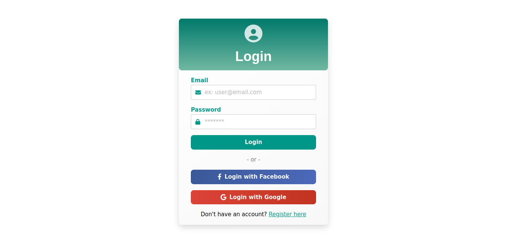 |
| :------------------------------------------: |
|               Página de *Login*                |


|  |
| :------------------------------------------: |
|               Página de *Register*               |


### Página Inicial
Na página inicial, um utilizador consegue ver e aceder às publicações com estado *public*. Existe a possibilidade de filtrar as publicações através de *tags*. Para além disso, dá a possibilidade do utilizador fazer *login/logout*.

#### Screenshots

| 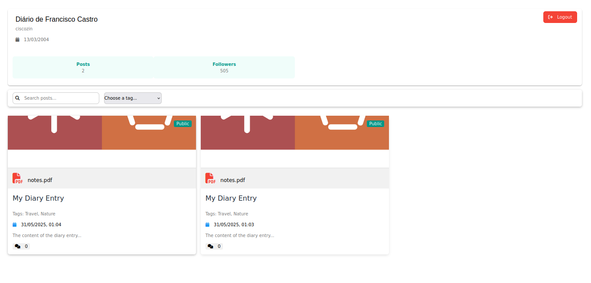 |
| :------------------------------------------: |
|               Página Inicial               |

### Publicações
Estrutura do modelo de um post:
```txt
Post = {
    producer: String,
    title: String,
    content: String,
    createdAt: Date,
    isPublic: Boolean,
    tags: [String],
    files: [fileSchema],
    comments: [commentSchema]
}
```
Deste esquema, é possível verificar que um *post* tem um *producer* (autor), um título, um conteúdo, uma data de criação, um *boolean* que representa a visibilidade, uma lista de *tags*, uma lista de ficheiros e, por fim, uma lista de comentários. De modo a criar um post, o administrador deve introduzir um SIP (*Submission Information Package*) em *ZIP*. Este ficheiro *zip* conter os ficheiros desejados e um *manifesto-SIP.json*, com o seguinte formato:
```txt
{
  "title": "My Diary Entry",
  "content": "The content of the diary entry...",
  "tags": ["travel", "nature"],
  "isPublic": true,
  "files": [
    {
      "path": "images/photo1.jpg",
      "type": "image/jpeg"
    },
    {
      "path": "documents/notes.pdf", 
      "type": "application/pdf"
    }
  ]
}
``` 
Nas páginas das publicações, os utilizadores tẽm a liberdade de descarregar os ficheiros da mesma publicação. Por outro lado, na página de edição, o administrador pode editar os campos e até mesmo remover a publicação.

### Screenshots
| 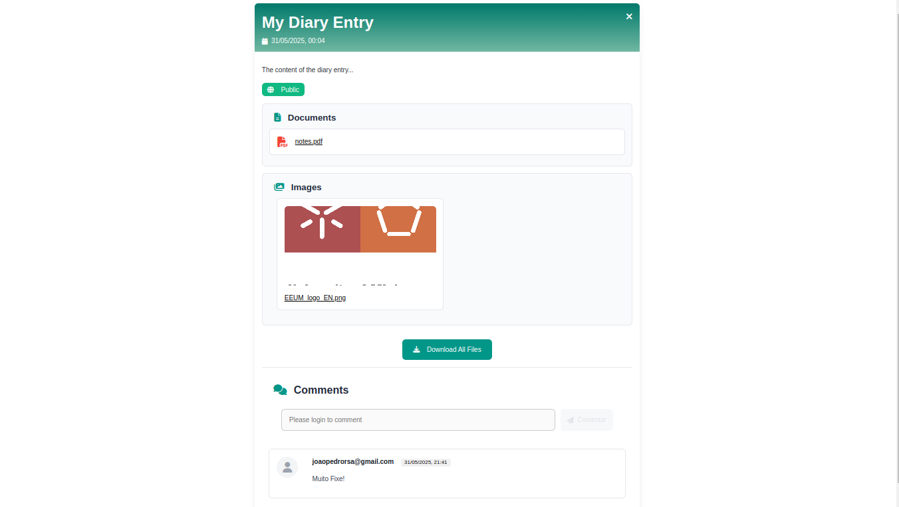 |
| :------------------------------------------: |
|               Página de Post para um utilizador               |

| 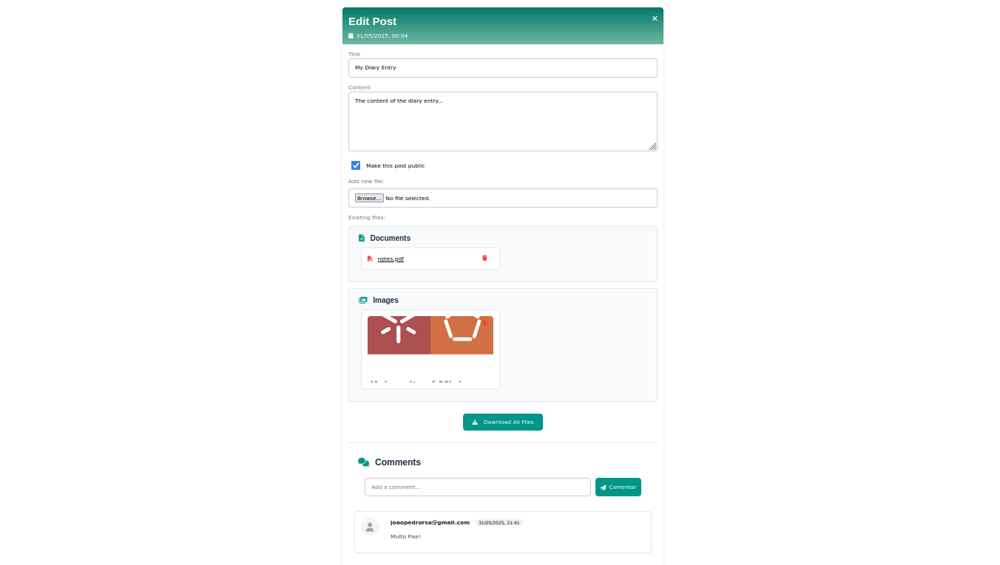 |
| :------------------------------------------: |
|               Página de edição de um Post               |

| 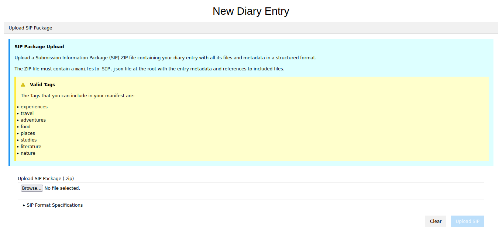 |
| :------------------------------------------: |
|               Página de adicionar um Post               |

### Administrador
Um administrador tem acesso, após o login, a uma dashboard com o número de utilizadores, número e listagem de publicações e botões para outras páginas inerentes.
Em primeiro lugar, a página de *Users Dashboard* remete para a página de gestão de utilizadores. Nesta página, o administrador pode:
- Editar informação de um utilizador existente
- Apagar um utilizador existente
- Adicionar um novo utilizador

Na página de *logs*, o administrador tem acesso à lista de todas as logs (*do frontend*). Na lista, o administrador tem a seu dispor à data, método, código de *status* e o respetivo *URL*. 

Por fim, nas páginas de estatísticas, o administrador tem a seu dispor informações retiradas a partir das logs. Aqui, o administrador tem acesso ao número total de *requests*, de *logins*, e à taxa de sucesso dos pedidos. Para além disso, esta *dashboard* conta com um gráfico de horas de pico (*bar chart*), um gráfico de proporção dos códigos de *status* (*pie chart*) e 3 listas com os *URLs* mais acedidos, as publicações mais acedidas e as mais descarregadas.

| 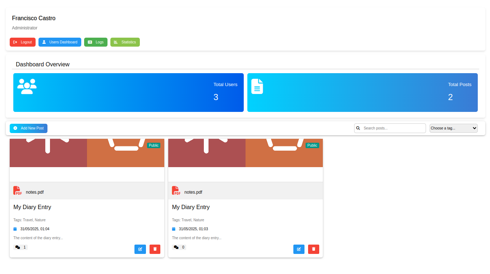 |
| :------------------------------------------: |
|               Página Inicial do Administrador          |

|  |
| :------------------------------------------: |
|               Página de gestão de Utilizadores               |

| 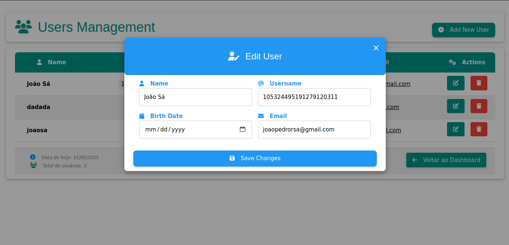 |
| :------------------------------------------: |
|               Página de editar um Utilizador               |

| 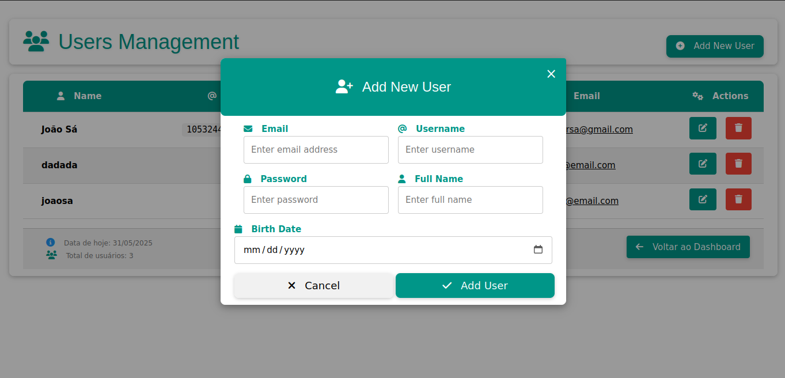 |
| :------------------------------------------: |
|               Página de adicionar um Utilizador               |

| 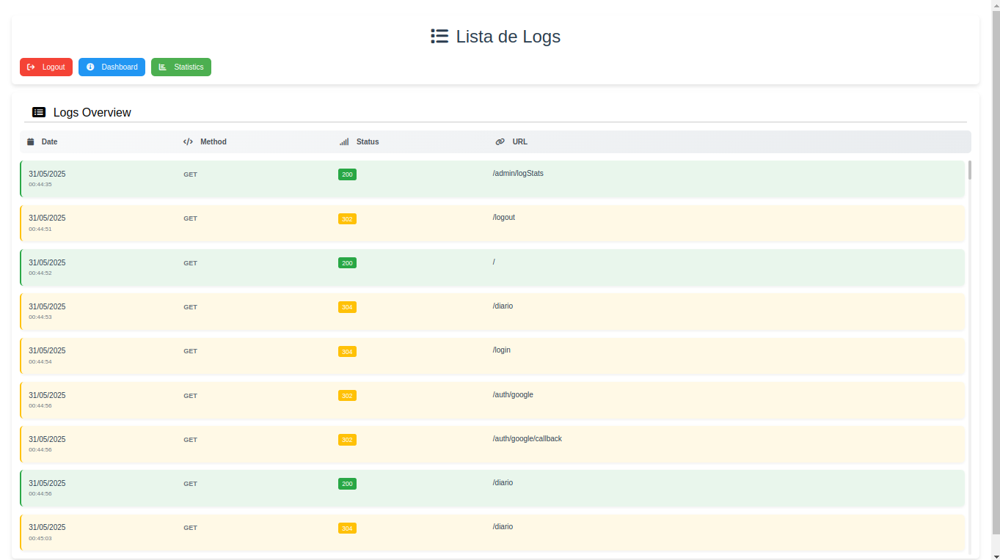 |
| :------------------------------------------: |
|               Página de logs                |

| 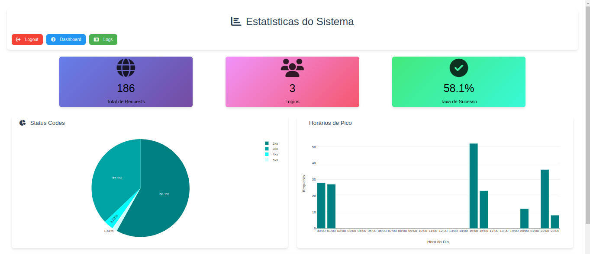 |
| :------------------------------------------: |
|               Página de estatísticas 1                |

| 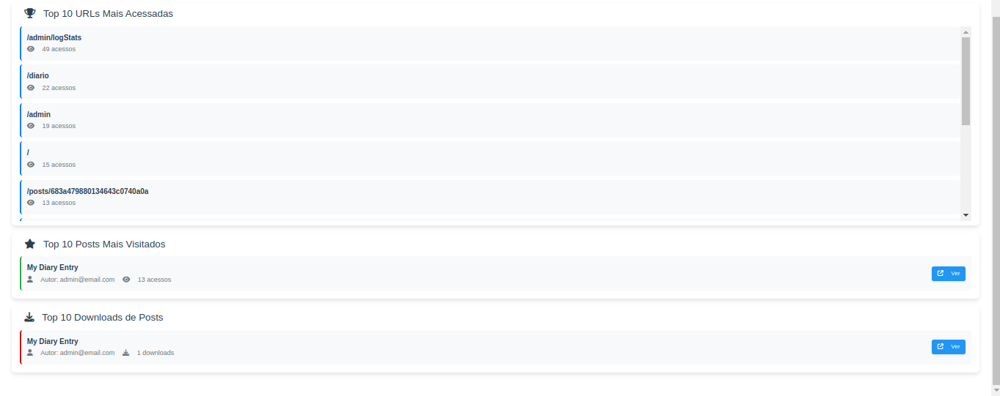 |
| :------------------------------------------: |
|               Página de estatísticas 2                |


## 🛠️ API
De modo a comunicar com o backend, o grupo implementou uma API REST que liga as componentes do projeto.
### Endpoints
#### Relacionados com Utilizadores
- `GET /api/users/` – Lista todos os utilizadores (exceto administradores). Requer autenticação e ser admin;
- `POST /api/users/` - Cria um novo utilizador com os dados fornecidos no corpo da requisição;
- `GET /api/users/:email` - Recolhe os dados de um utilizador com base no email. Requer autenticação e ser admin;
- `DELETE /api/users/:email` - Remove um utilizador com base no email. Requer autenticação e ser admin;
- `PUT /api/users/:email` - Atualiza os dados de um utilizador com base no email. Requer autenticação e ser admin;
  
#### Relacionados com o Diário
- `GET /api/diary` - Lista entradas do diário, podendo filtrar por isPublic=true e/ou tags;
- `GET /api/diary/:id` – Recolhe os dados de uma entrada específica do diário com base no seu ID;
- `GET /api/diary/download/:id` – Gera e descarrega um ficheiro .zip da entrada com manifesto e ficheiros associados; 
- `POST /api/diary` – Cria uma nova entrada no diário a partir de um ficheiro SIP .zip. Requer autenticação e ser admin;
- `PUT /api/diary/:id` – Atualiza uma entrada existente, podendo adicionar/remover ficheiros. Requer autenticação e ser admin;
- `DELETE /api/diary/:id` – Apaga uma entrada do diário e os ficheiros associados. Requer autenticação e ser admin;
- `POST /api/diary/:id/comments` – Adiciona um comentário a uma entrada do diário. Requer autenticação;

#### Relacionados com Autenticação
- `POST /auth/login` - Autentica um utilizador regular (email + password). Retorna token JWT.
- `POST /auth/admin/login` - Autentica um administrador (email + password). Retorna token JWT.
- `GET /auth/google` - Inicia autenticação via Google OAuth2 (redireciona para login do Google).
- `GET /auth/google/callback` - Callback após autenticação Google. Gera token JWT, define cookies e redireciona o utilizador.
- `GET /auth/facebook` - Inicia autenticação via Facebook OAuth (redireciona para login do Facebook).
- `GET /auth/facebook/callback`- Callback após autenticação Facebook. Gera token JWT, define cookies e redireciona o utilizador.

> [!WARNING]
>  No caso da autenticação com o facebbok, era necessário termos página de política de privacidade e um Business Account para poder ter acesso a dados de outros users que não os users presentes na app de desenvolvimento do Meta Developers, logo apenas os nossos users conseguem utilizar esse login.

## 🚀 Execução
Para executar o projeto, optámos por desenvolver um *docker compose*. Desta maneira, para executar o projeto, basta introduzir o seguinte comando na raíz do projeto.
```bash
sudo docker compose up --build
```
